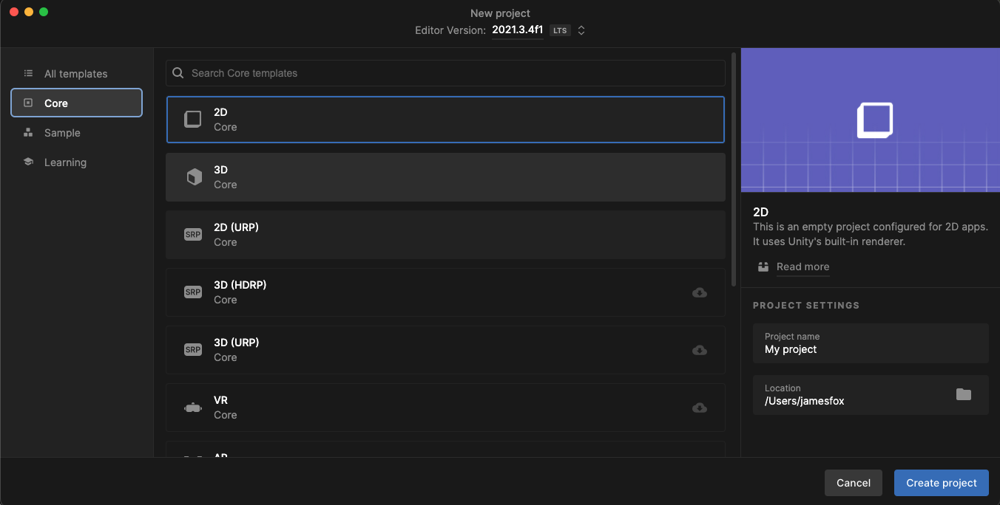
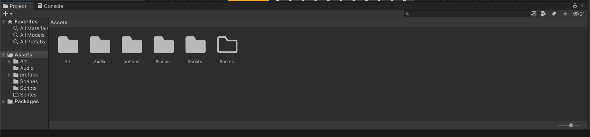
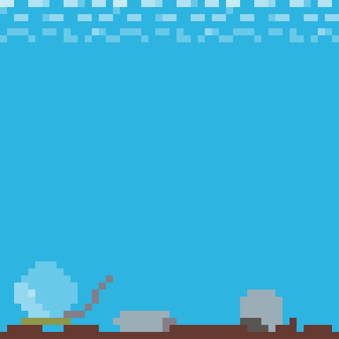

<h1 align="center" style="color:green">Frog Platformer </h1>

<p align="center">
    
</p>
<p align="center">By <a href="https://github.com/WillRod42">William Rodriguez</a>, <a href="https://github.com/CamLRay">Cameron Ray</a>, <a href="https://github.com/JeremyM45">Jeremy Martin</a>, <a href="https://github.com/jfox25">James Fox</a>
</p>

## Technologies Used

- C#
- Unity
- Asesprite
- Jsfxr
- [Assets Used](https://assetstore.unity.com/packages/2d/characters/pixel-monster-pack-75508#description) 

## Project Requirements

1. Unity 2021.3.4f1

## Project Setup

1. Clone this repository to your desktop using git clone

```
git clone https://github.com/WillRod42/epicodus-jam
```
2. Create a new 2D project in unity

 

3. Add the files from this github to the Assets Folder

 

4. Your ready to play!
## How to Play
* Movement is done with A and D keys
* To Jump press spacebar
* C and shift to attack
* Enemies are rats, leeches, spiders, scorpions, and the <span style="color:red"> Mega Leech</span>. 

## Custom assets/sprites
#### Frog assets
* Base Sprite<br>
 <br>

 Idle Animation: <br>
 Idle Sheet: <br>

* Movement Animations<br>
 Walking Animation: <br> 
 Walking Sheet: <br> 
 Jump Animation: <br>
 Jump Sheet: <br> 

* Attack Animations<br>
 Attack Animation: <br>
 Attack Sheet: <br>

 Running Attack Animation: <br>
 Running Attack Sheet: <br>

 Air Attack Animtion: <br>
 Air attack Sheet: <br>


#### Game world assets
* Ladybutton<br>
 <br>
 <br>
* Lantern & Firefly<br>
 Firefly: <br>
 Lantern Empty: <br>
 Lantern Lit: <br>
 Lantern Lit Animation: <br>
 lantern Lit Sheet: <br>
 * Dungeon sprites<br>
 FirePlant Barrier: <br>
 Lava Platform: <br>
* Tiles
 Dirt: <br> 
 Stone: <br> 
 Water: <br> 
 Lava: <br> 


## GitHub Link

[Link to Code on GitHub](https://github.com/WillRod42/epicodus-jam)

## Bugs

- Character can get stuck on spikes and walls.

## Future Improvements

- Add more custom assets
- Add more levels
- Variable jump for frog
- Develop a story

## License

MIT
Copyright (c) 2022 William Rodriguez, Cameron Ray, Jeremy Martin, James Fox

